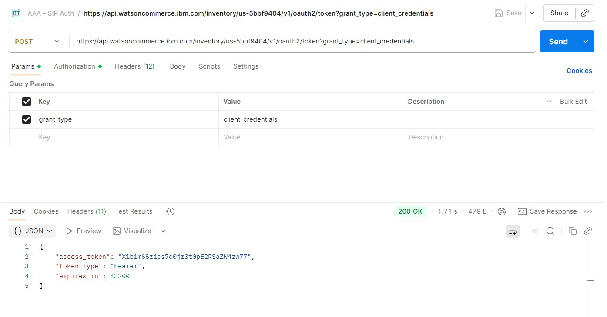

## 3.4 APIs in Sterling Intelligent Promising

IBM Sterling Intelligent Promising provides an extensive collection of APIs across on Cloud and container environments.

You can access the APIs in the [API Hub](https://developer.ibm.com/apis/catalog/inventoryvis--ibm-sterling-intelligent-promising-apis/Introduction).

To access IBM Sterling Intelligent Promising APIs, you will first need to generate an authorization bearer token for authorized access to the APIs for your tenant via the OAuth 2.0 client_credentials flow. To do this you will need the following details:
These details above can be provided to SIP to generate a token for usage on further API calls as follows:

1. Run the below command after replacing the clientId and clientSecret variables with actual values.

```
base64Credentials=$(echo -n "clientId:clientSecret" | base64)
echo $base64Credentials
```

2. Run the below command to request the server to generate a token
```
curl --request POST --url {url}/{service}/{tenantId}/v1/oauth2/token \ 
    --header 'Authorization: Basic {base64Credentials}'  \
    --header 'Accept: application/json' \
    --header 'Content-Type: application/x-www-form-urlencoded'  \
    --data 'grant_type=client_credentials'
```    

Read the access_token from the response received from the output



# References

https://www.ibm.com/docs/en/sip?topic=configuring-service-configurations

https://www.ibm.com/docs/en/sip?topic=configuring-promising

https://www.ibm.com/docs/en/sip?topic=promising-configuring-service
