# Tutorial: Powering 20-Minute Delivery with IBM Sterling Intelligent Promising (SIP)

# Objective

The objective of this tutorial is to provide a step-by-step guide to configuring IBM Sterling Intelligent Promising (SIP) to support Quick Commerce to enable the retailers to fulfill customer orders in under 20 minutes by orchestrating intelligent sourcing, real-time inventory visibility, and accurate delivery commitments.

# Prerequisites

To follow this tutorial, you will need:

1. Get the Sterling Intelligent Promising trial [version](https://www.ibm.com/account/reg/us-en/subscribe?formid=urx-52281). IBM Sterling Order Management System (OMS) will be part of this.
2. The import SIP API collections into PostMan and get the Access Token. Refer [here](./API.md)

# Introduction

Quick Commerce is transforming the retail experience. Customers now expect groceries, essentials, and lifestyle products to arrive at their doorstep in 10 to 20 minutes. This shift is driven by:
- Urbanization and dense delivery zones
- Mobile-first shopping behavior
- Competitive pressure from hyperlocal delivery startups

To meet these expectations, retailers must build agile, intelligent supply chains that can:
- Balance inventory across distributed nodes
- Optimize fulfillment logic in real time
- Scale operations profitably

IBM Sterling Intelligent Promising (SIP) is purpose-built to address these challenges. It enables:
- Real-time order orchestration
- Smart sourcing from the best location
- Fast, accurate delivery commitments
- Margin-aware decision-making

# 1. The Business Challenge

To deliver within 20 minutes, retailers must overcome several operational hurdles:

- **Fulfillment Complexity:** Balancing standard vs. express vs. Quick commerce home delivery with different optimization rules.
- **Distributed Inventory:** Stock across stores, dark stores, and warehouses, each with different lead times, calendars and capacities.
- **Regional Variations:** Fulfillment logic differs by geography, requiring sourcing rules that align with state-level business strategies.
- **Carrier Constraints:** Multiple service providers with different zones, transit times, calendar schedules and costs.
- **Accurate Promises:** Customers must see realistic delivery times at checkout, not just theoretical SLAs.

# 2. Fulfillment optimization techniques in OMS

OMS has different flavours of optimizations to suit different fulfillment objectives for specific fulfillment speeds.
1. Minimizing number of shipments - Finds a delivery date that can be achieved after optimizing for minimum the number of shipments
2. Earliest delivery - Find the earliest delivery time irrespective of the number of shipments it results into
3. Least cost - Find the delivery date with the least cost to fulfill

This tutorial focuses on the **Earliest Delivery** strategy to support Quick Commerce.

# 3. Quick Commerce Configuration - Steps

Let us demonstrate SIP’s capability to integrate nodes, carriers, sourcing rules and capacity into a unified promising engine and calculate the right delivery date to deliver within the 20-minute duration.

These are the steps you need to follow:

1. Create Nodes in OMS via Application Manager
2. Create Nodes in SIP
3. Lead Time Configuration
3. Transit Time Configuration
4. Setting up of Distribution Groups
5. Carriers,Shipping group & Carrier Services configuration
6. Capacity Scheduling
7. Carrier Pickup Schedules
8. Adjusting inventory

### Assumptions

For this use-case, we have adjusted inventory only at the single store.

In a real-life scenario wherein, multiple stores are part of the network then the actual store can be chosen by using promising rules that are based on customer zipcode or customer area. E.g. if area is "indirangar" then choose either store1 (EGL), store2(indiranagar) for sourcing. The customer area can be configured as a custom attribute and used while creating promising rules. When invoking the promising rules, the customer area custom attribute can be passed in API input, so that system can source from the right node.

Here, Promising Rule has been configured within IBM Sterling Intelligent Promising (SIP) using attribute pincode. This rule enables SIP to prioritize sourcing inventory from the nearest fulfillment center or store(here Store_1), based on the customer's delivery pincode(here 600100). It ensures faster delivery by leveraging localized inventory.

## 3.1 Configuration 

### 3.1.1. Create Nodes in OMS via Application Manager

1. In Application manager navigate to **Application > Distributed Order Management > Fullfillment NetworkModel** 

2. Open the **create node** screen. Enter the below informations.

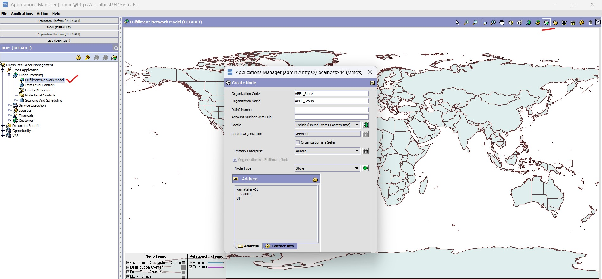

After the creation of node in APP Manager, the node will show up under **Nodes and capacity > Nodes**

### 3.1.2. Create Nodes in SIP

Let us create **Store_1** node.

1. Click on the **Configuration > node > Create node** button towards the right to create a node.

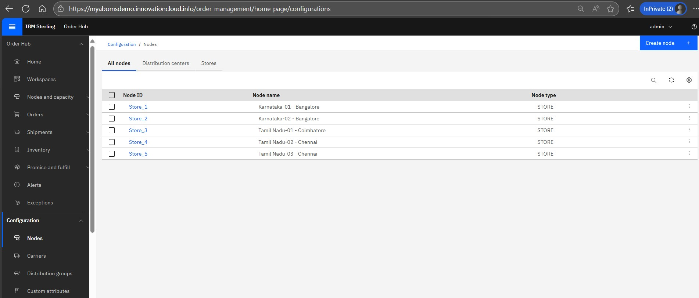

Here is the node details.

2. Fill in the **Primary information** tab as below 

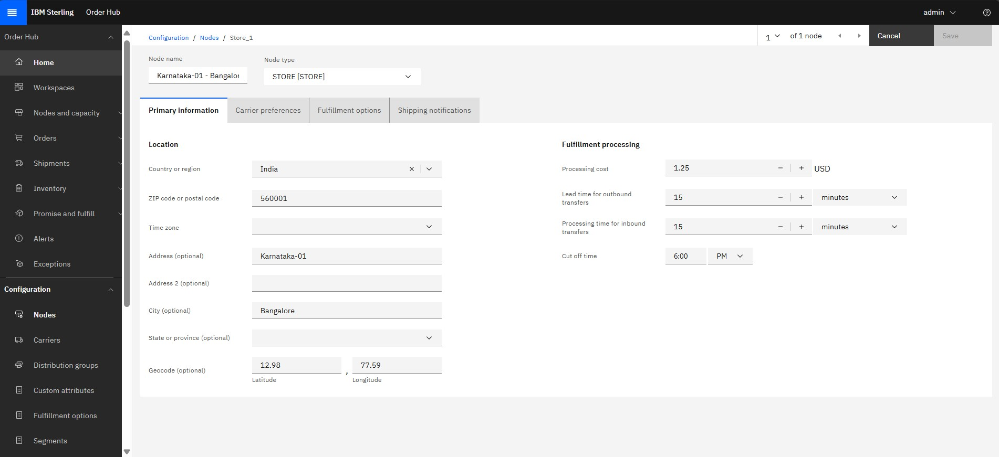

3. Fill in the **carrier preferences** tab as below 

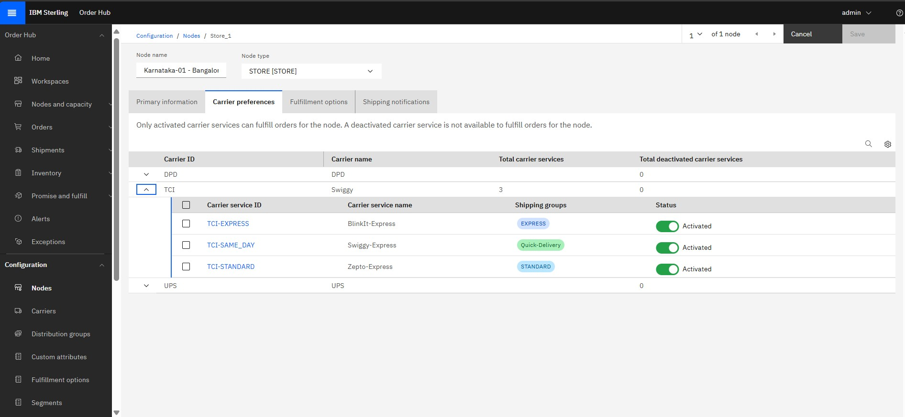

4. In the **fullfillment Options** tab ship option should be selected 

5. If the customer doesn't intend to use the node for pickup/ship, the same can be turned off for the specific node.

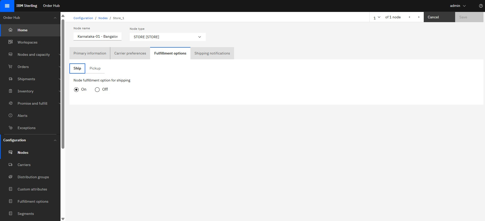

Shipping notification tab is not required currently .

The **Store_1** is created.

6. Similarly the other 4 nodes should be created as like the below.

- Store_1 (Karnataka -01- Bangalore, 560001) – Capacity 100, Lead Time 10 min.
- Store_2 (Karnataka -01- Bangalore, 560076) – Capacity 80, Lead Time 10 min.
- Store_3 (TamilNadu-01-Coimbatore, 641001) – Capacity 90, Lead Time 10 min.
- Store_4 (TamilNadu-01-Chennai, 600100) – Capacity 70, Lead Time 10 min.
- Store_5 (TamilNadu-02-Chennai, 600100) – Capacity 70, Lead Time 10 min.

### 3.1.3. Lead Time Configuration

Lead Time is the time taken by a node (store, DC, dark store) to prepare an order for shipment once it is received. Lead time directly impacts the earliest possible ship time.

**Example:** If a store takes 10 minutes to pick, pack, and hand over the parcel to the carrier, then the lead time = 10 minutes.

### API for Lead Time
Here is the  [API](https://developer.ibm.com/apis/catalog/inventoryvis--ibm-sterling-intelligent-promising-apis/api/API--inventoryvis--promising-apis#getLeadTimeForNode) to retrieve the lead time for the particular node.

Here is the  [API](https://developer.ibm.com/apis/catalog/inventoryvis--ibm-sterling-intelligent-promising-apis/api/API--inventoryvis--promising-apis#patchLeadTimeForNode) to update the lead time for the particular node.  

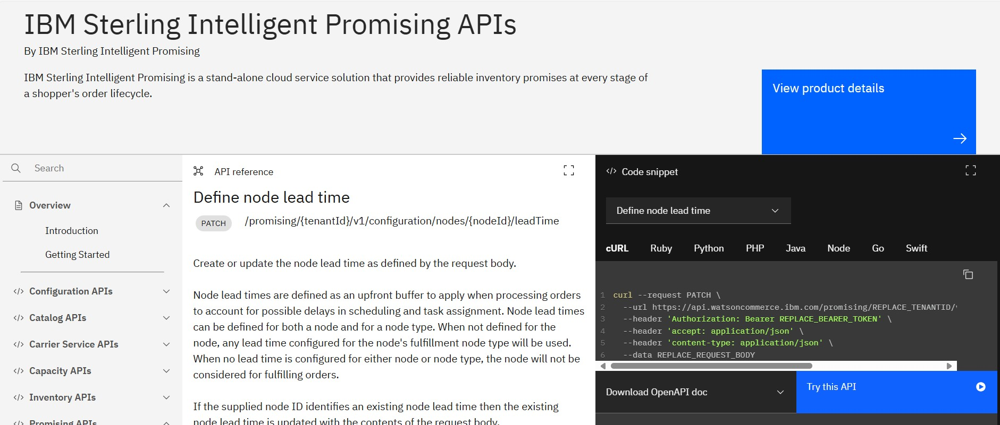

### Configure Lead Time

1. Configure the Lead Time using the update API given above. You can use the sample input Json Data available [here](./Json/lead.json)

Once the lead time is configured, the Lead Time will appear in SIP as below.

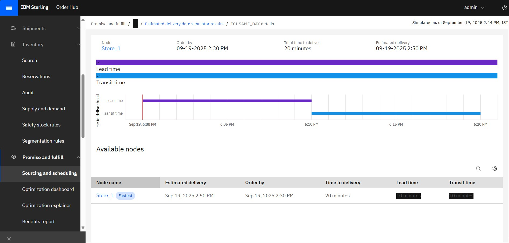

### 3.1.4. Transit Time Configuration

Transit Time is the time taken by the carrier to deliver the shipment from the origin node (store/DC) to the customer’s address. Transit time gets added on top of the node lead time to compute the Expected Delivery Date (EDD).

**Example:** If the courier takes 20 minutes to move a package from the store to the customer’s location, then transit time = 20 minutes.

### API for Transit Time

The API to Get transit duration configured for the specified carrier service and the shipping zone is [here](https://developer.ibm.com/apis/catalog/inventoryvis--ibm-sterling-intelligent-promising-apis/api/API--inventoryvis--carrier-service-apis#fetchTransitDuration).

The API to Upload transit duration (and optionally transit delay) for the specified carrier service shipping zones is [here](https://developer.ibm.com/apis/catalog/inventoryvis--ibm-sterling-intelligent-promising-apis/api/API--inventoryvis--carrier-service-apis#bulkUpsertTransitDurationsByZonesForCarrierService).

### Configure Transit Time

1. Configure the Transit Time using the update API given above. You can use the sample input Json Data available [here](./Json/Transit.json)

Once the Transit time is configured, the Transit Time will appear in SIP as below.

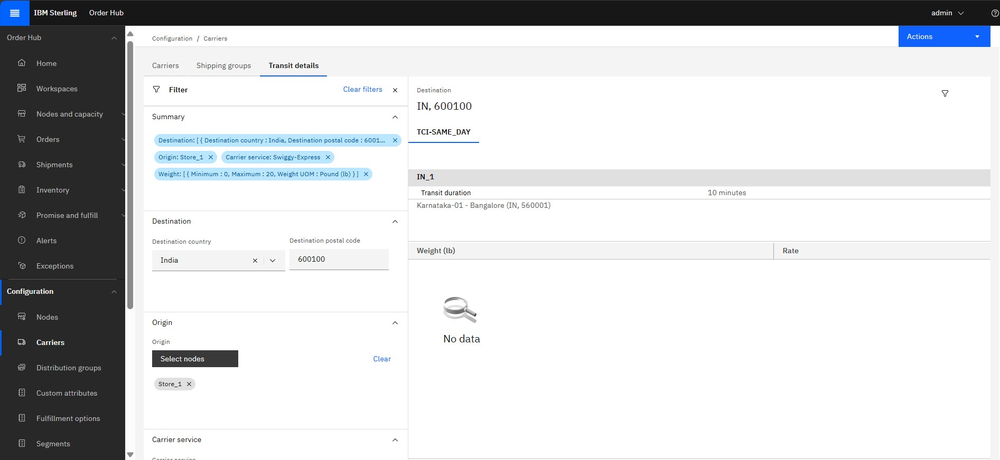

### 3.1.5. Setting up of Distribution Groups

You can define the single Distribution group, with multiple nodes. This structure allows flexible sourcing across regional nodes. This DG, NETWORK comprises of the multiple nodes defined above, across regions Karnataka/TamilNadu.

1. Create a Distribution group by clicking on the **Configuration > Distribution group >Create distribution group** button on the right most end .

2. Define Name,ID,Purpose as shown in the screenshot below 
3. Click on `Add nodes` button and 
4. Select 5 nodes created above 
5. Click on `Create`.

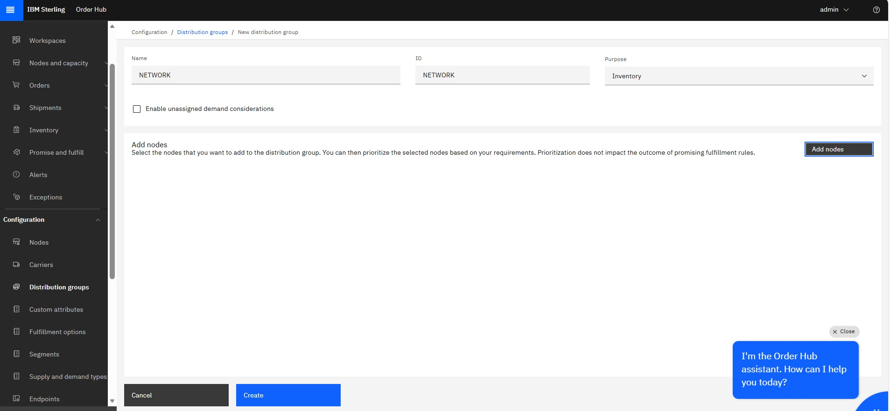

The below screen appears once the Distribution group is created.

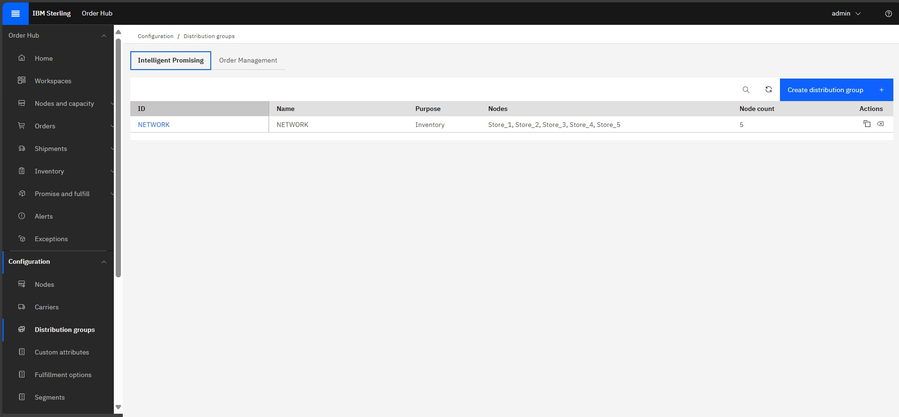

### 3.1.6. Carriers, Shipping group & Carrier Services configuration

#### 3.1.6.1 Create Carrier

   Let us create a carrier

   1. Click on **Configuration > Carriers > Create Carrier**

   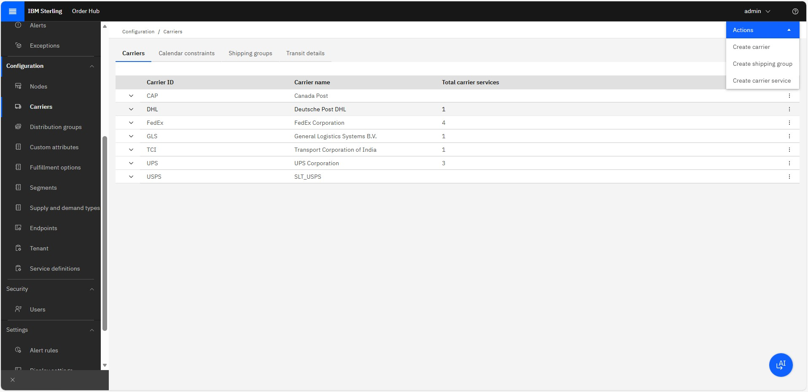

   2. Fill in the **carrier name** and **carrier id**

   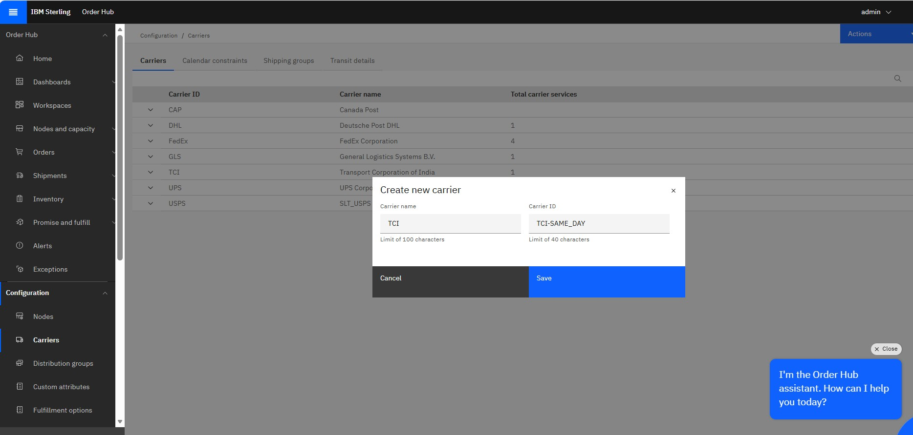

   #### 3.1.6.2 Create Carrier Service

   Let us create a carrier service for the defined carrier

   1. Click on right side three dots
   2. Click on **create carrier service** menu

   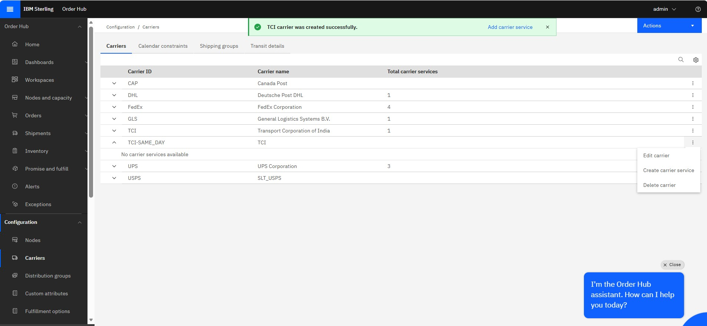

   3. Fill in the details in below screen. 
   4. Click on **Save**.

   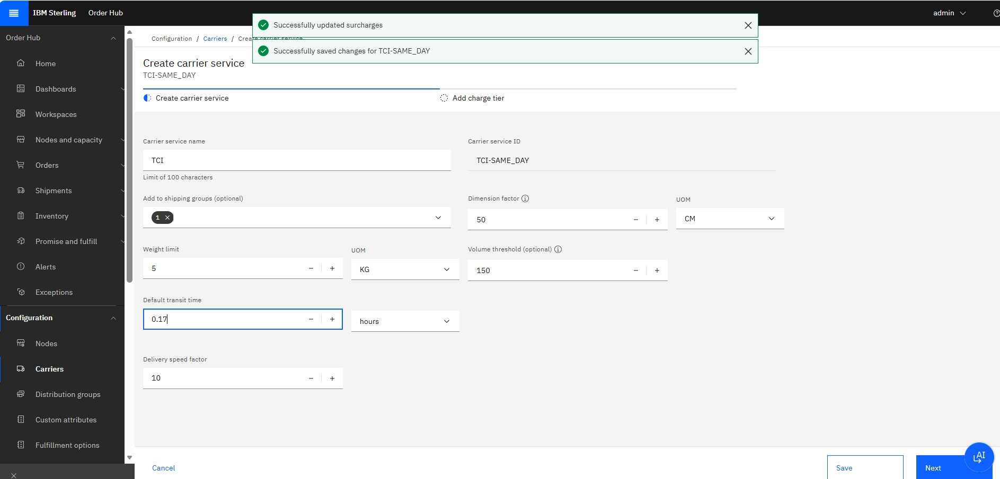

   5. Similarly define the below 3 carrier services within the above created TCI Carrier

   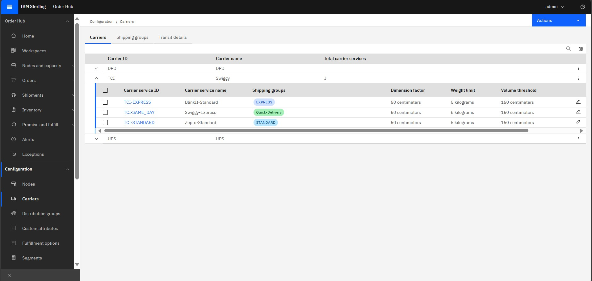

   #### 3.1.6.3 Create Shipping groups

   Let us create the Shipping groups and associate the carrier service to it.  

   1. Click on **Configuration > Carriers> Create shipping group**

   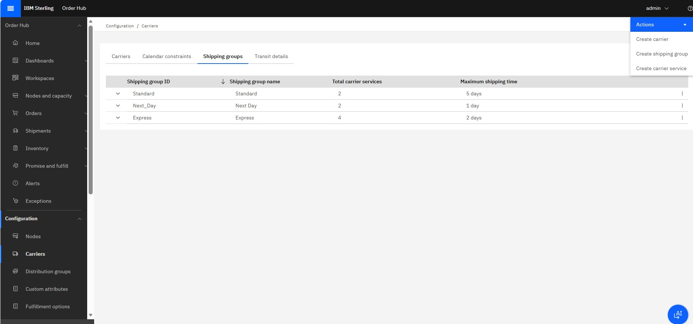

   2. Enter the **Shipping group name**, **id** and **transit duration**
   3. Click on **Next** button.
   
   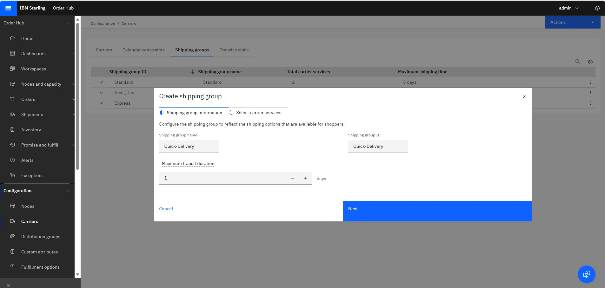

   4. Create and associate the STANDARD,Quick-Delivery and EXPRESS shipping groups to relevant carrier services as shown below 
   5. Click on **Save** button.

   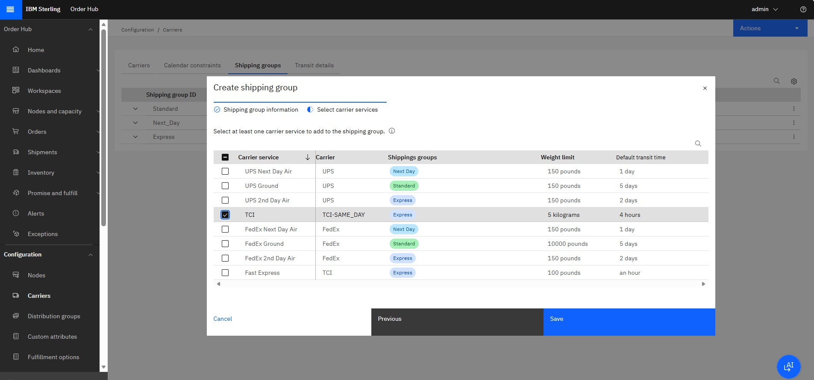

   Final configuration will appear as below 

   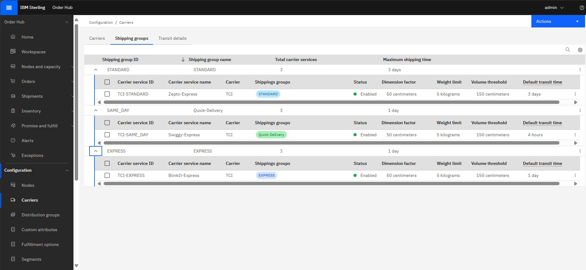

### 3.1.7. Capacity Scheduling

Need to configure the below capacity info for each node through API. Ensures the promising engine respects daily processing limits.

- **Weekly schedule :** Mon–Fri, 08:00–21:00,
- **Daily throughput capacity :** 72 orders.

### API

Here is the  [API](https://developer.ibm.com/apis/catalog/inventoryvis--ibm-sterling-intelligent-promising-apis/api/API--inventoryvis--capacity-apis#putAvailableCapacity) to create  Capacity Scheduling. 

A valid slot must meet the following requirements:
- slotStartIncl must be less than slotEndExcl.
- slotStartIncl must be less than useSlotByExcl
- useSlotByExcl must be less than or equal to slotEndExcl.

### Configure Capacity Scheduling 

1. Configure the Capacity Scheduling using API given above. You can use the sample input Json Data available [here](./Json/capacity.json)

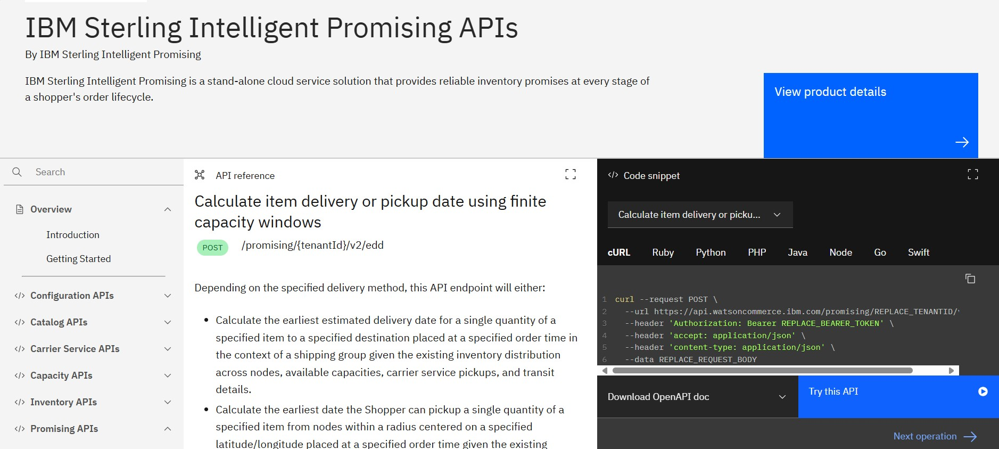

### 3.1.8. Carrier Pickup Schedules

We need to schedule the Pickups for every 10 min from 09:00 to 21:00 across weekdays through API. Multiple pickup slots allow faster order clearance into last-mile delivery.

### API

The Carrier Pickup Schedules can be retreived through [this](https://developer.ibm.com/apis/catalog/inventoryvis--ibm-sterling-intelligent-promising-apis/api/API--inventoryvis--promising-apis#getCarrierPickupSchedule) API.

The Carrier Pickup Schedules is created through [this](https://developer.ibm.com/apis/catalog/inventoryvis--ibm-sterling-intelligent-promising-apis/api/API--inventoryvis--promising-apis#putCarrierPickupSchedule) API. Sample input Json Data is available [here](./Json/pickup.json)

### Configure Carrier pickup schedule

1. Create the carrier pickup schedule ranging from validFromDateIncl to validToDateIncl using create API given above. You can use the sample input Json Data available [here](./Json/pickup.json)

### 3.1.9. Adjusting inventory

This section verifies the availability of the necessary inventory.

1. In the `Inventory search` make sure the inventory is available in the `Available to Ship` and `Available to Pick up` sections. 

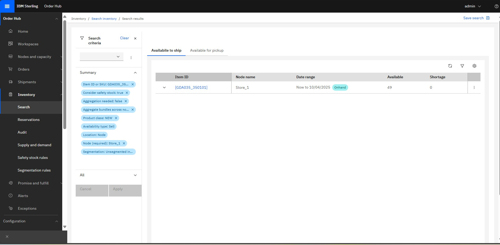

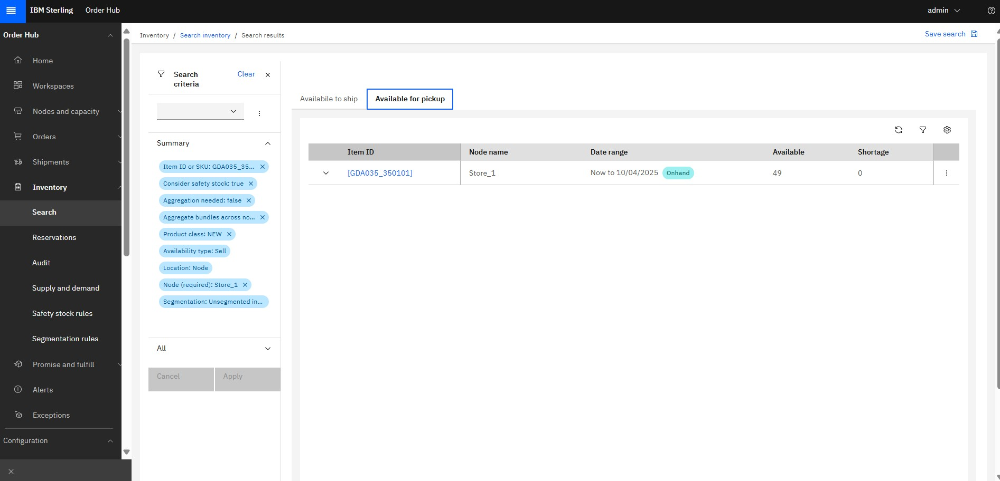

2. If the inventory is not available, you can adjust the inventory based on the supply type of the inventory, such as on hand, in transit, scheduled etc as shown below.

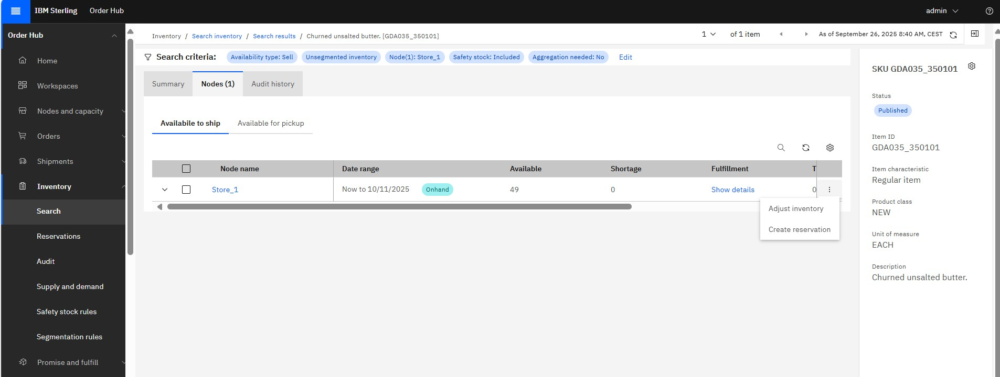

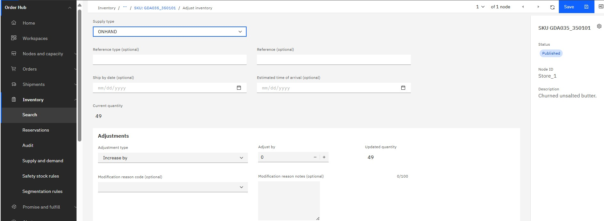

## 3.2 Final configurations View in UI 

`CityCool` is the e-commerce site designed for demonstration purpose and available in OMS. Once you have done the above configurations you would be able to view the same in UI as below .

Here's a screenshot of the `CityCool` website with  Intelligent Promising enabled

1. Notice the `Order By` and `Ready for pickup` time shown in the UI.

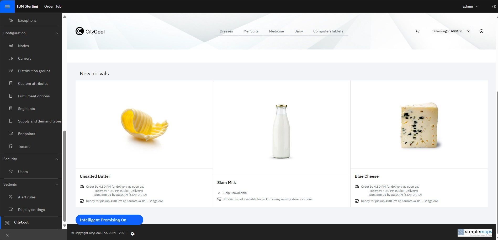

Quick 20min delivery is visible here as shown

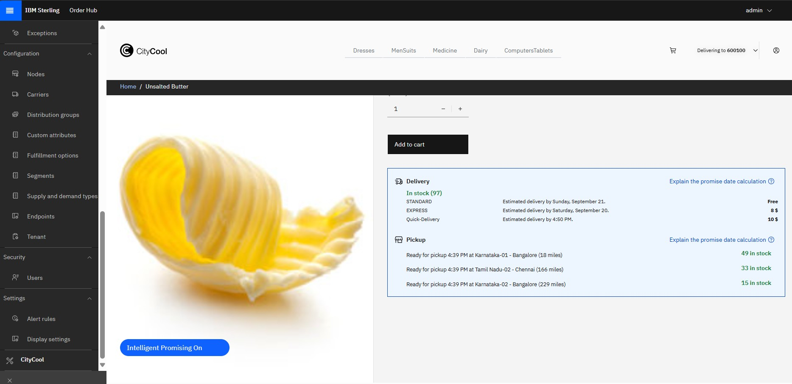

#### Standard Delivery

Optimized for cost; longer lead + transit times.

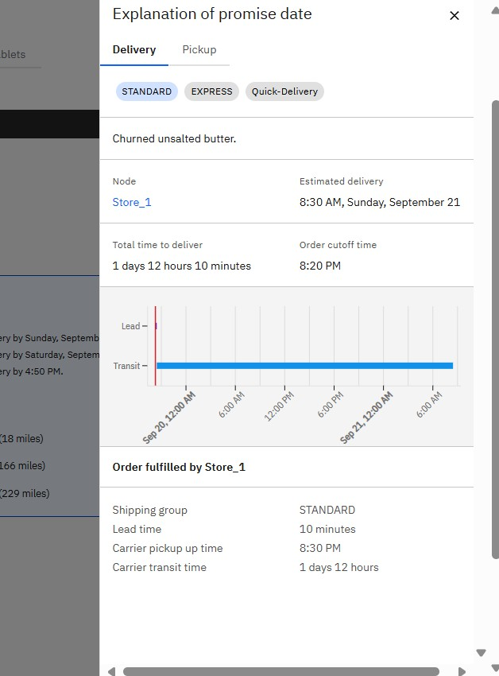

#### Express Delivery

Optimized for earliest date; shorter transit times, premium carriers.

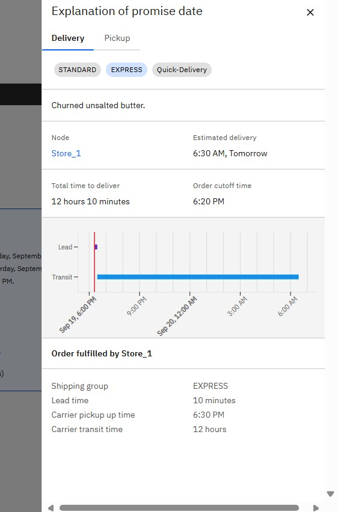

#### Quick Commerce
Ultra-low lead times (e.g., 10 mins picking) + hyperlocal transit times (e.g., 10–20 mins bike delivery) to achieve 10–20 min delivery promises.

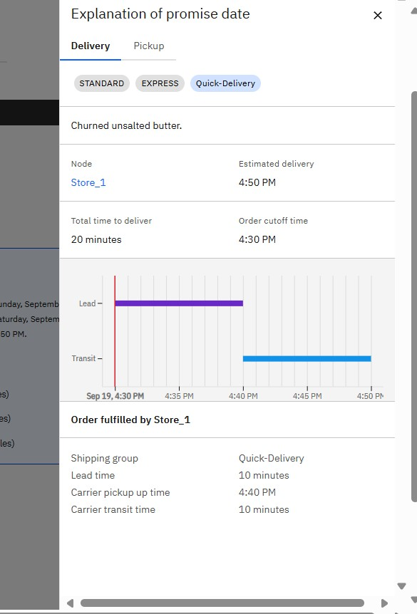

## 3.3 Estimated Delivery Date Simulator

Let us configure and view the EDD simulator results.

### API

The simulator parameters is created through [this](https://developer.ibm.com/apis/catalog/inventoryvis--ibm-sterling-intelligent-promising-apis/api/API--inventoryvis--promising-apis#getEDDConsideringCapacity) API. 

### Create Parameters 

1. Create the simulator parameters using the above API. You can use the sample input Json Data available [here](./Json/edd.json).

### View EDD Simulator

1. Click on the EDD Simulator

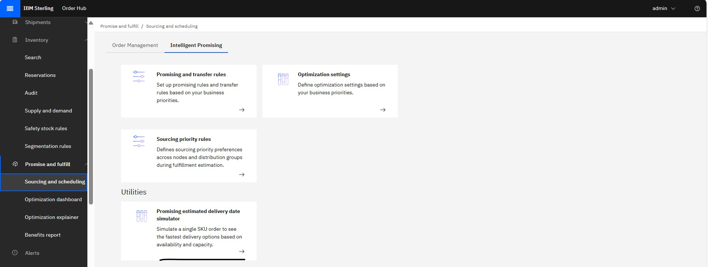

You will see the Simulator screen as below with required parameters. The parameters to be displayed here are configured via the APIs as given below.

2. Enter the required parameter and click on the `Run Simulation`.

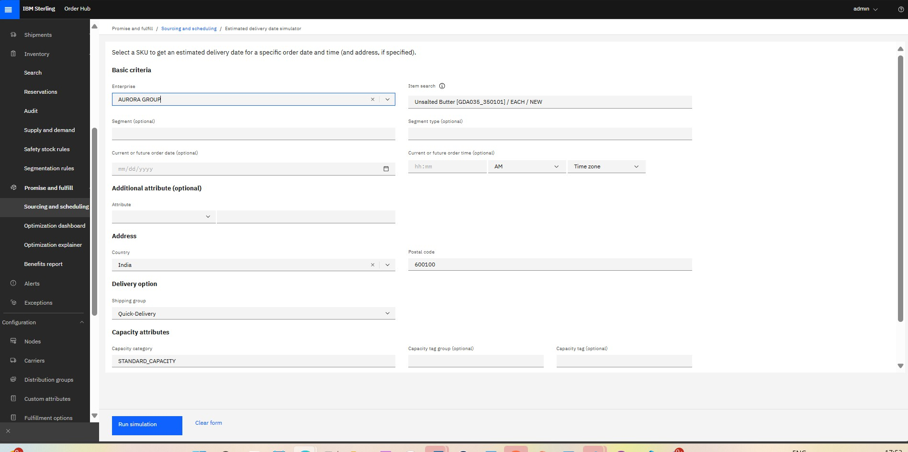

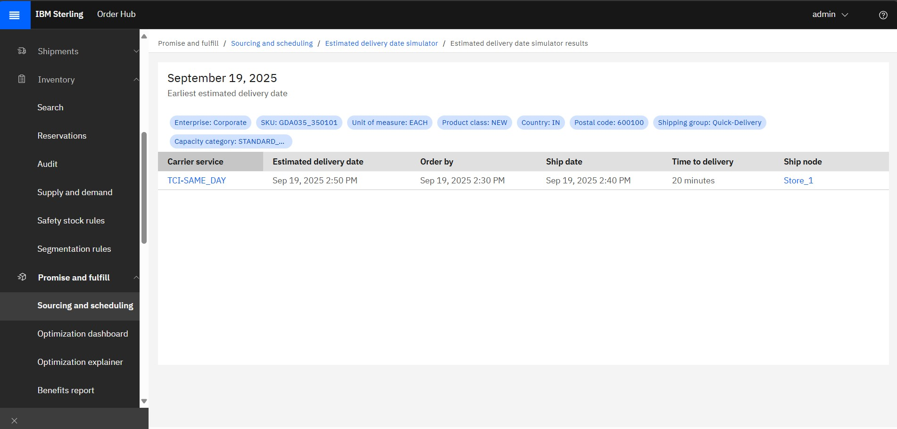

The results are shown as below. Here we can see the `Lead time ,Transit Time` etc.

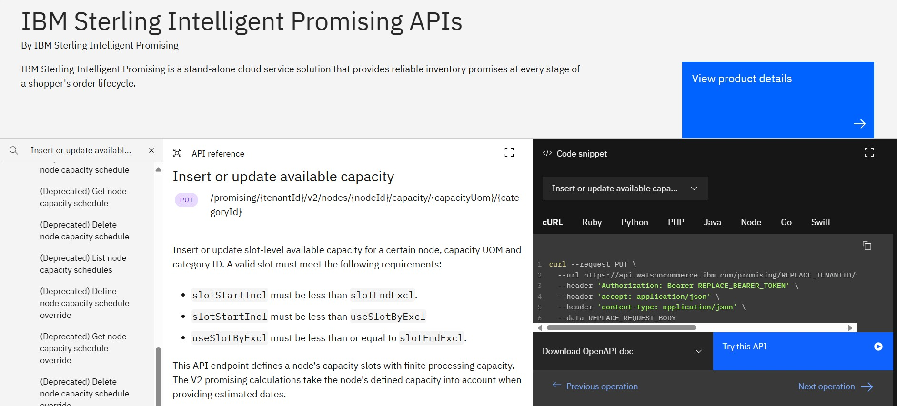

# 4. Business Impact

- **Increase Online Sales:** Higher conversion rates with faster delivery options. Builds customer trust and loyalty through reliable commitments.
- **Productivity Increase:** Automated sourcing and fulfillment decisions reduce manual effort. Streamlined workflows accelerate order processing.
- **Operational Efficiency:** Optimized order routing ensures faster fulfillment from the best node. Real-time visibility enables proactive exception handling.
- **Reduced Costs:** Lower shipping costs through intelligent carrier and node selection. Minimized order cancellations and returns.
- **Improve Inventory Productivity:** Better utilization of distributed inventory across channels. Faster inventory turnover with accurate availability and fulfillment.
- **Profitability:** Balances ultra-fast delivery with cost by aligning sourcing rules and carrier selection.
- **Scalability:** A framework that can be extended to new geographies, carriers, and fulfillment types.

# 5. Summary
Quick commerce is not just about speed; it’s about delivering intelligence at scale. IBM Sterling OMS, enhanced by Sterling Intelligent Promising, empowers retailers to promise—and deliver—within minutes. 

The tuitorial demonstrates how nodes, carriers, and sourcing rules can be orchestrated to support both standard and express fulfillment, while also uncovering areas where SIP can evolve your business (like region-based promising rules and fulfillment-type optimization).Quick commerce represents the next wave of e-commerce, promising delivery of essentials within minutes. Fueled by changing consumer expectations, urban density, and advancements in AI and logistics,platforms like Blinkit, Zepto, and Swiggy Instamart are redefining convenience. 

This article examines the operational models, challenges, and opportunities in the Indian context, including dark stores, inventory optimization, and sustainability concerns. It also highlights the role of data-driven personalization and the competitive landscape that’s pushing traditional retailers to adapt or collaborate.

With this foundation, businesses can confidently step into the 10-minute delivery race—profitably and at scale.

# Gratitude
We would like to express our gratitude to prouct experts - Venita Glasfurd, Werner Trapp, Yaduvesh Sharma, and Nistha Sinha for their invaluable support in addressing this use-case.
